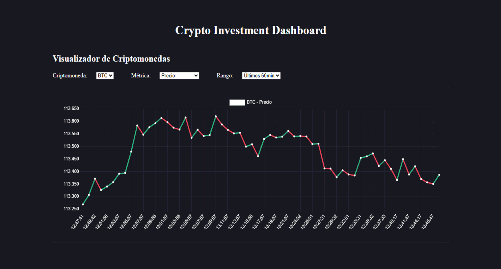
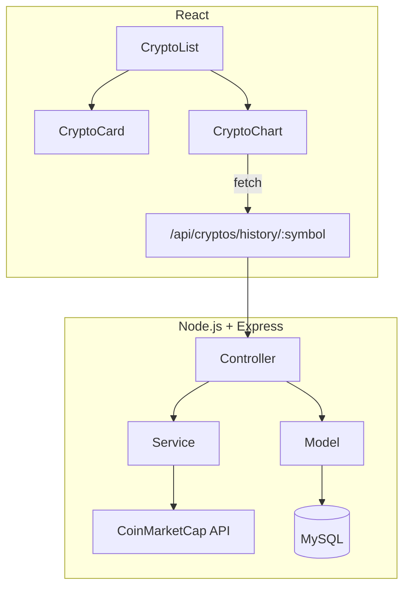

# 💼 Crypto Investment – Fullstack App (Frontend + Backend)



Este es un proyecto **Fullstack** desarrollado como parte de una prueba técnica para una vacante en desarrollo **Fullstack (Node.js + React)**. Permite visualizar información en tiempo real y el historial reciente de criptomonedas usando datos de CoinMarketCap.

---

## 🧩 Estructura del Proyecto

```
crypto-investment/
├── backend/       # API REST con Express y MySQL
├── frontend/      # Interfaz web con React y Vite
└── README.md      # (este archivo)
```

---

## 🔌 Comunicación entre Frontend y Backend

- El **frontend** se comunica con el **backend** mediante **HTTP (RESTful API)**.
- Las rutas del backend comienzan con `/api/cryptos` y se consumen desde React mediante `fetch` o `axios`.
- El endpoint base del backend debe configurarse en el archivo `.env` del frontend como:

```env
VITE_API_BASE_URL=http://localhost:3001
```

---

## 📡 Diagrama de Arquitectura General



---

## 🚀 Requisitos Generales

- Node.js (v18 o superior)
- MySQL
- Cuenta gratuita en [CoinMarketCap](https://coinmarketcap.com/api/) para obtener una API Key

---

## 🛠️ Configuración Rápida

1. Clona el repositorio:
   ```bash
   git clone <REPO_URL>
   cd crypto-investment
   ```

2. Configura el backend:
   ```bash
   cd backend
   npm install
   cp .env.example .env
   # Edita el .env con tu info (API_KEY, DB, etc.)
   npm start
   ```

3. Configura el frontend:
   ```bash
   cd ../frontend
   npm install
   cp .env.example .env
   # Edita VITE_API_BASE_URL con la URL de tu backend
   npm run dev
   ```

---

## 📁 Repos por separado

- 🔧 [`/backend`](./backend): Servidor Express, persistencia, y pruebas automatizadas.
- 💻 [`/frontend`](./frontend): Interfaz moderna con React, gráficos interactivos y notificaciones.

---

## ✅ Funcionalidades principales

- Consulta en tiempo real de precios de criptomonedas (BTC, ETH, SOL)
- Historial de precios de la última hora con intervalos personalizables
- Persistencia automática en base de datos cada 15 segundos
- Notificaciones y feedback visual
- Cobertura de pruebas en el backend (controladores, modelos, servicios, app, etc.)

---

## 🧪 Pruebas

- El **backend** tiene pruebas unitarias y de integración usando **Jest** y **Supertest**.
- El **frontend** aún no incluye tests, pero está preparado para integrar **Jest**, **Testing Library** o **Cypress**.

---

## 🧑‍💻 Autor

Desarrollado por **Camilo Yaya** como parte de una prueba técnica fullstack.

---

## 🧾 Licencia

MIT
