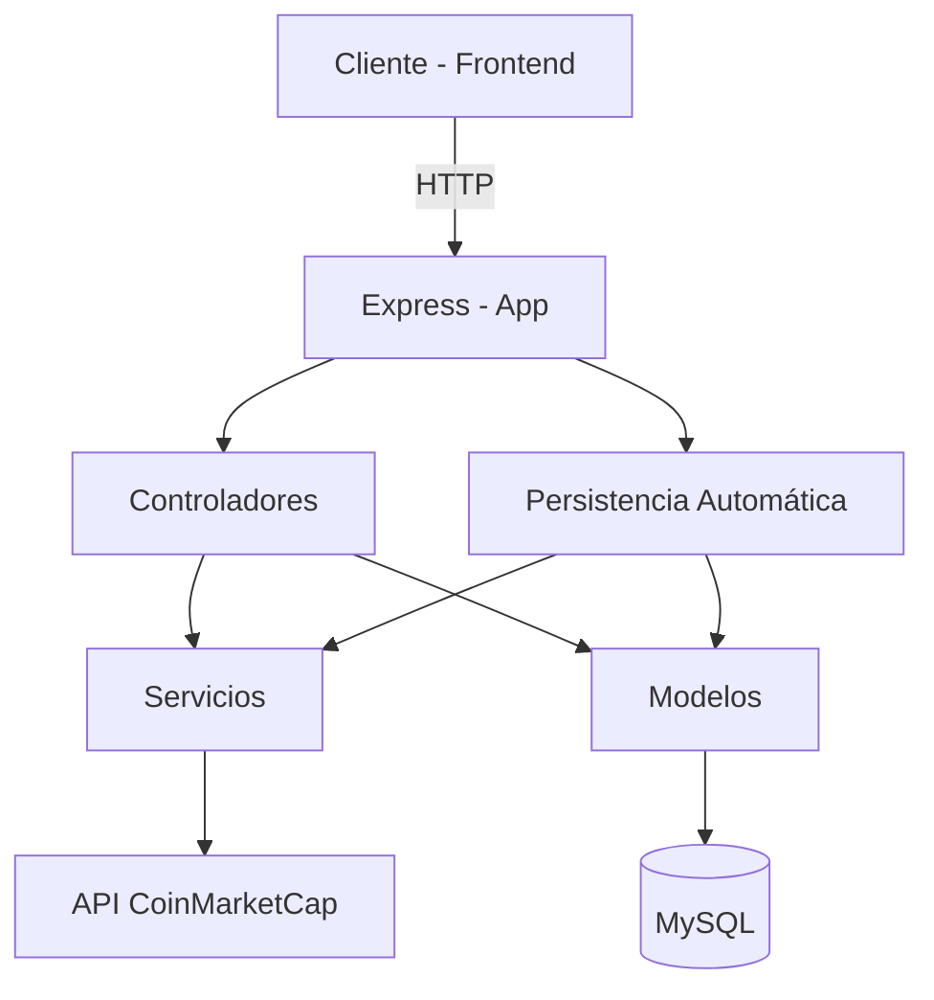

# 📈 Crypto Investment – Backend

Este es el backend de la aplicación **Crypto Investment**, una plataforma para visualizar información y evolución de criptomonedas en tiempo real utilizando datos de la API de CoinMarketCap.

---

## 🧱 Arquitectura del Proyecto



---

## 🚀 Tecnologías utilizadas

- **Node.js**
- **Express**
- **MySQL**
- **Axios** (llamadas HTTP)
- **dotenv** (configuración de variables de entorno)
- **Jest** + **Supertest** (pruebas unitarias y de integración)

---

## ⚙️ Requisitos

- Node.js (v18 o superior)
- MySQL
- Una clave API válida de [CoinMarketCap](https://coinmarketcap.com/api/)

---

## 📂 Variables de entorno

Crea un archivo `.env` en el directorio raíz del backend con el siguiente contenido:

```env
PORT=3001
CMC_API_KEY=TU_API_KEY_DE_COINMARKETCAP

DB_HOST=localhost
DB_PORT=3306
DB_USER=root
DB_PASSWORD=
DB_NAME=crypto_investment
```

---

## 🧪 Scripts disponibles

- `npm start`: Inicia el servidor en `http://localhost:3001`
- `npm test`: Ejecuta todas las pruebas
- `npm run coverage`: Muestra el porcentaje de cobertura de pruebas

---

## 🧠 Funcionalidades principales

- **Persistencia automática** cada 15 segundos de los precios de BTC, ETH y SOL
- **Endpoints RESTful** para obtener:
  - Cotización actual de una criptomoneda
  - Historial de precios por símbolo
- **Evita duplicación** en la base de datos mediante control de cambios
- **Cobertura de pruebas** para controladores, modelos, servicios, utils, configuración y más

---

## 📮 Endpoints principales

| Método | Ruta                          | Descripción                          |
|--------|-------------------------------|--------------------------------------|
| GET    | `/api/cryptos?symbol=BTC`     | Consulta en tiempo real por símbolo |
| GET    | `/api/cryptos/history/BTC`    | Historial de precios (última hora)  |

---

## 🧪 Cobertura de pruebas

El backend tiene cobertura de pruebas en:

- Controladores
- Modelos
- Servicios
- Utilidades (`persistJob`)
- App y configuración (`env.js`, `server.js`)

---

## 🧰 Buenas prácticas

- Código modular y testeable
- Uso de `async/await`
- Mocks de dependencias en pruebas
- Arquitectura limpia y clara

---

## 🔐 Seguridad

- Las claves sensibles se mantienen en `.env`
- No se expone información confidencial al cliente

---

## 📤 Despliegue y versión

- Backend preparado para integración continua (CI)
- Compatible con despliegue en cualquier servicio Node (Railway, Render, etc.)

---

## 🧑‍💻 Autor

Proyecto técnico desarrollado como parte de una evaluación para una vacante en desarrollo **Fullstack (Node.js + React)**, realizado por Camilo Yaya.
